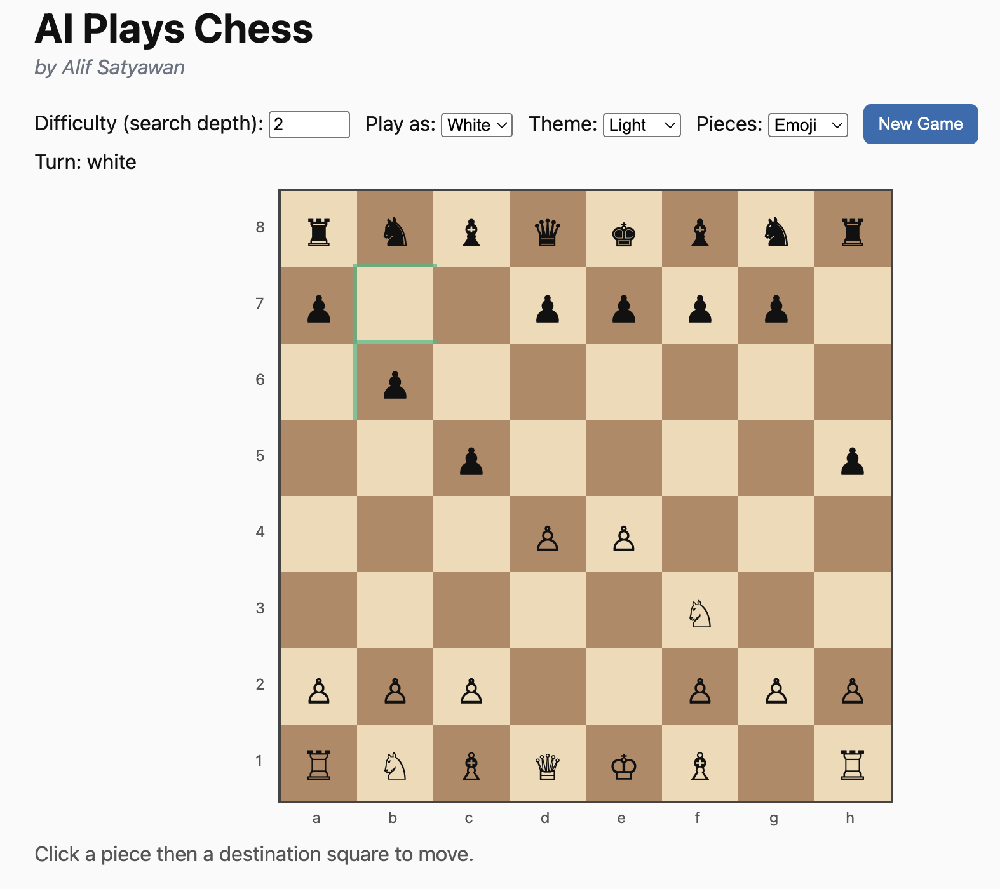
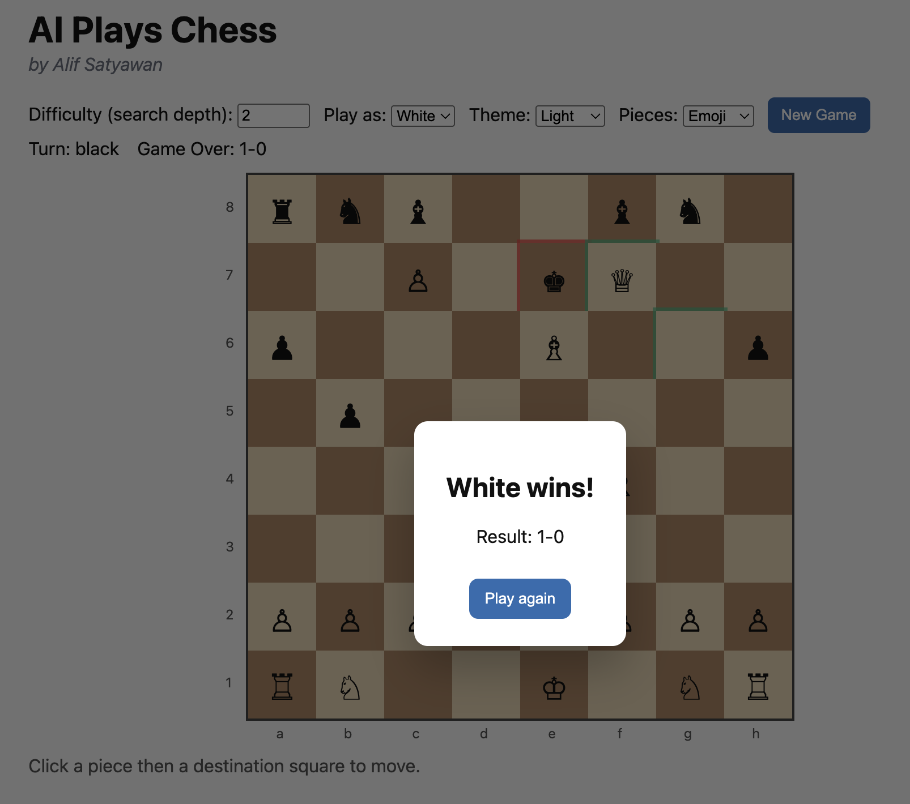

## **AI Plays Chess**

A classical AI chess engine in Python — Minimax + Alpha-Beta pruning with a web interface for human vs. AI play


**Note:** This project uses classical AI techniques — specifically adversarial search (Minimax with Alpha-Beta pruning) and heuristic evaluation — rather than machine learning. It demonstrates how traditional AI methods can power a functional chess engine, allowing human players to compete against an AI opponent at configurable difficulty levels.


### **Live demo**
- [aiplayschess.com](https://aiplayschess.com/)

### **Features**
- **Engine**: `python-chess` move generation + legality
- **Search**: Minimax with alpha–beta pruning and basic move ordering
- **Evaluation**: material + piece-square tables + mobility
- **Web UI**: Flask backend, HTML/JS frontend
- **Difficulty**: adjustable search depth (1–6)
- **Play as**: choose to play as White or Black before each game
- **UX**: “Thinking…” indicator, optimistic piece movement, and a “Play again” overlay

---

### **Quick start**
Clone the repo, create a venv, install dependencies, and run the server.

#### macOS/Linux (bash/zsh)
```bash
cd /Users/alifsatyawan/AIPlaysChess
python3 -m venv .venv
source .venv/bin/activate
pip install -r requirements.txt

# Run (option 1): via Flask CLI
export FLASK_APP=web/app.py
python -m flask run

# Run (option 2): directly with Python
python web/app.py
```

#### Windows/macOS PowerShell
```powershell
cd /Users/alifsatyawan/AIPlaysChess
python3 -m venv .venv
./.venv/bin/python -m pip install -r requirements.txt

# Run (option 1): Flask CLI
$env:FLASK_APP = "web/app.py"
./.venv/bin/python -m flask run --host=127.0.0.1 --port=5000

# Run (option 2): direct
./.venv/bin/python web/app.py
```

Open `http://127.0.0.1:5000` in your browser.

---

### **How to play**
1. Pick a difficulty (search depth). Higher depths think longer but play stronger.
2. Choose a side under “Play as” (White or Black). If you choose Black, the AI moves first.
3. Click a piece, then click a destination square. Promotions auto-queen.
4. Use “Play again” to restart (the overlay now hides correctly).

---

### **Screenshots**

#### Game Start 


#### Game Ended


---

### **Performance tips**
- Depth 4–6 now use tighter time budgets and a responsive UI. If you still want faster replies, select a lower depth.
- The UI moves your piece immediately (optimistic update) and shows “Thinking…” while the AI computes.

### **Project layout**
```
engine/        # Core engine: Game wrapper, AI, evaluator
web/           # Flask app, templates, static assets
tests/         # Pytest tests
smoke_test.py  # Quick end-to-end check
```

---

### **Notes**
- Scores are in centipawns (positive favors White).

---

### **Requirements**
See `requirements.txt` (Flask, python-chess, pytest).

